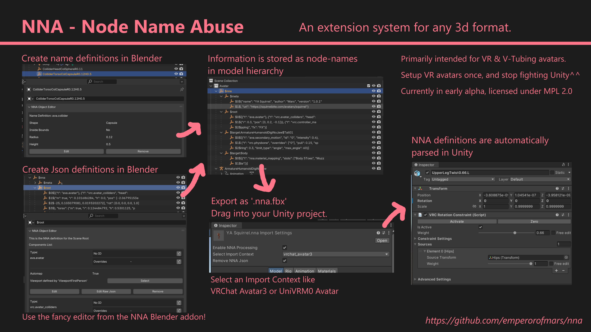

// Licensed under CC-BY-4.0 (<https://creativecommons.org/licenses/by/4.0/>)

= ⛧ NNA - Node Name Abuse ⛧
:homepage: https://github.com/emperorofmars/stf
:keywords: nna, 3d, fbx, extension, fileformat, format, interchange, interoperability
:hardbreaks-option:
:idprefix:
:idseparator: -
:library: Asciidoctor
:table-caption!:
ifdef::env-github[]
:tip-caption: :bulb:
:note-caption: :information_source:
endif::[]

**Extend any 3d format by abusing node-names to store data!**

toc::[]

It works by serializing data into node-names in the scene hierarchy.
This is about as heretical as it sounds, but it works, very well.

[caption=,title=""]
[%autowidth, cols=3*, frame=none, grid=none]
|===
|Get it for:
|**https://github.com/emperorofmars/nna_blender/releases/latest[Blender]**
|**https://github.com/emperorofmars/nna_unity/releases/latest[Unity]**
|===

⭐ Star this repo if you love heresy! ⭐

---

**This repository hosts documentation for the format and available component-types.**

[caption=,title=""]
[%autowidth, cols=3*, frame=none, grid=none]
|===
|link:./nna_spec.adoc[Core Specification]
|link:./nna_component_types.adoc[Available Component Types]
|link:./roadmap.adoc[Roadmap]
|===

Issues, discussions & PRs Welcome!

== Why
FBX is the current best 3D interchange format. Sadly, it is non-extensible and undocumented, hardly optimal.
This is a way to add additional information to 3d models in any format, primarily FBX.

The best case would be if a proper open & extensible 3d interchange format was created. In that case I'll happily delete this^^
https://github.com/emperorofmars/stf-unity[I created a proof-of-concept of such a format]. Alone it is of course not practically possible to bring such a project into a widely available production ready state. This is the next best thing.
https://gist.github.com/emperorofmars/d8abf0f4b9bd5434f9543511b243a254[If you are asking yourself why wouldn't glTF 2.0 just work, read this!]

== Goals
* A 3d file should be a self-contained single source of truth for all its functionality, and work across different game engines.
* Artists without technical knowledge beyond 3d modeling, should have an easy time creating VR & V-Tubing avatars.
* End users without technical knowledge, should be able to easily adapt and upload VR & V-Tubing avatars.

== License
This repository is licensed under **CC-BY-4.0** (<https://creativecommons.org/licenses/by/4.0/>)
